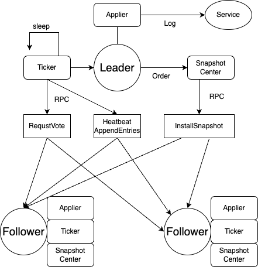
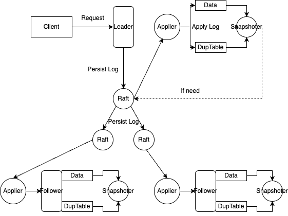
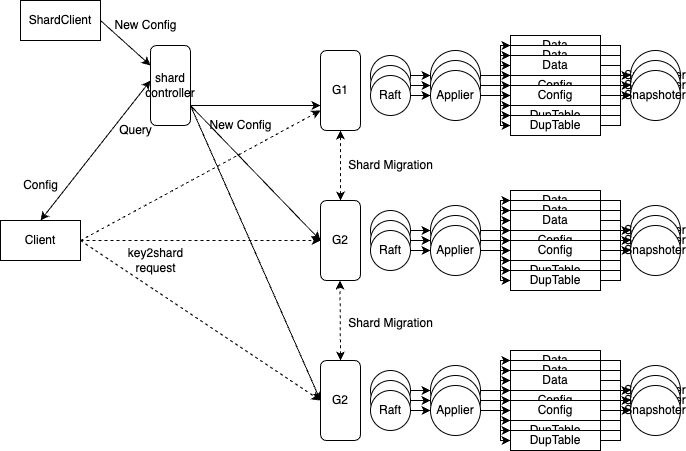

# MIT 6.5840 DISTRIBUTED SYSTEMS (2023)

[syllabus](https://pdos.csail.mit.edu/6.824/schedule.html)

## [Lab 1: MapReduce](https://github.com/haofumei/MIT-6.5840-Distributed-Systems/tree/master/src/mr/)

## [Lab 2: Raft](https://github.com/haofumei/MIT-6.5840-Distributed-Systems/tree/master/src/raft)

Architecture:

## [Lab 3: Fault-tolerant Key/Value Service](https://github.com/haofumei/MIT-6.5840-Distributed-Systems/tree/master/src/kvraft)

Architecture:

## [Lab 4A: Sharded Controller](https://github.com/haofumei/MIT-6.5840-Distributed-Systems/tree/master/src/shardctrler)

## [Lab 4B: Sharded Key/Value Service](https://github.com/haofumei/MIT-6.5840-Distributed-Systems/tree/master/src/shardkv)

Architecture:

