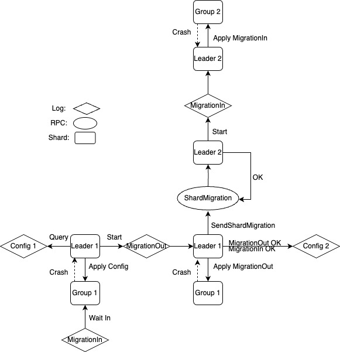

# **Key idea and overall design**

**Idea: use logs to update the persistent state of servers.**

So my overall sharding service design:



If the persistent states are only modified by logs, the **durability** and **linearizability** can be guranteed.

**Linearizability**: all the log operations are deterministic, so if the same order logs are maintained in the same shard, the linearizability is guranteed.

**Durability**: operations are only executed after the corresponding logs have been persisted, and the service will reexecute from the last checkpoint after crash.

**Atomicity and Isolation**: since there are no distributed transactions, A and I are guranteed naturally.

**Consistency**: duplicated check and other mechanics to gurantee that the same log only executes once, in this way, the service will switch to the expected consistent state.

# Some details about Test

### Test: snapshots, join, and leave ...

Consider what else should be added to snapshot.

### Test: concurrent configuration change and restart...

Most tricky test, since Raft won't apply the logs whose terms are not matching its current term after restart. Always starting a new agreement for a higher config can solve this problem. If there is no higher config can be applied, which means that the current config is the newest config, the client request or migration can come in to trigger Raft to apply the before logs.

### Test: challenge

Segment the data into different shards, so the migration won't affect the unrelated shard, and the migration out shard can be deleted after the migration.

# Test result

```
Test: static shards ...
  ... Passed
Test: join then leave ...
  ... Passed
Test: snapshots, join, and leave ...
labgob warning: Decoding into a non-default variable/field Num may not work
  ... Passed
Test: servers miss configuration changes...
  ... Passed
Test: concurrent puts and configuration changes...
  ... Passed
Test: more concurrent puts and configuration changes...
  ... Passed
Test: concurrent configuration change and restart...
  ... Passed
Test: unreliable 1...
  ... Passed
Test: unreliable 2...
  ... Passed
Test: unreliable 3...
  ... Passed
Test: shard deletion (challenge 1) ...
  ... Passed
Test: unaffected shard access (challenge 2) ...
  ... Passed
Test: partial migration shard access (challenge 2) ...
  ... Passed
PASS
ok  	6.5840/shardkv	104.155s
```
